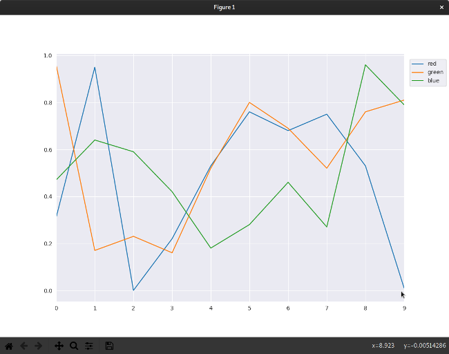
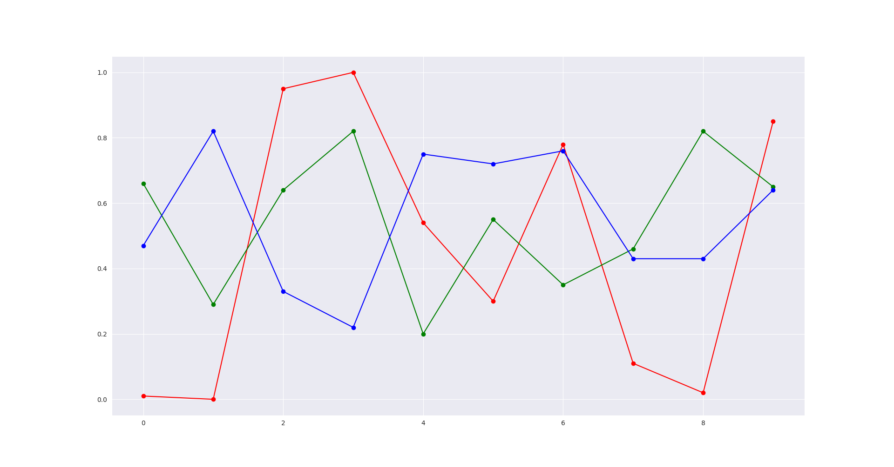

# Getting started with data science using Python

[Fonte: Getting started with data science using Python](https://opensource.com/article/19/9/get-started-data-science-python)

Doing data science with Python offers limitless potential for you to parse, interpret, and structure data in meaningful and enlightening ways.

Data science is an exciting new field in computing that's built around analyzing, visualizing, correlating, and interpreting the boundless amounts of information our computers are collecting about the world. Of course, calling it a "new" field is a little disingenuous because the discipline is a derivative of statistics, data analysis, and plain old obsessive scientific observation.

But data science is a formalized branch of these disciplines, with processes and tools all its own, and it can be broadly applied across disciplines (such as visual effects) that had never produced big dumps of unmanageable data before. Data science is a new opportunity to take a fresh look at data from oceanography, meteorology, geography, cartography, biology, medicine and health, and entertainment industries and gain a better understanding of patterns, influences, and causality.

Like other big and seemingly all-inclusive fields, it can be intimidating to know where to start exploring data science. There are a lot of resources out there to help data scientists use their favorite programming languages to accomplish their goals, and that includes one of the most popular programming languages out there: Python. Using the Pandas, Matplotlib, and Seaborn libraries, you can learn the basic toolset of data science.

If you're not familiar with the basics of Python yet, read my introduction to Python before continuing.

## Creating a Python virtual environment

Programmers sometimes forget which libraries they have installed on their development machine, and this can lead them to ship code that worked on their computer but fails on all others for lack of a library. Python has a system designed to avoid this manner of unpleasant surprise: the virtual environment. A virtual environment intentionally ignores all the Python libraries you have installed, effectively forcing you to begin development with nothing more than stock Python.

To activate a virtual environment with venv, invent a name for your environment (I'll use example) and create it with:


```bash
$ #
$ # python3 -m venv example
$ mkdir ~/Aprendendo/data-science/python
$ cd ~/Aprendendo/data-science/python
$ pipenv install
```

Source the activate file in the environment's bin directory to activate it:


```bash
$ # source ./example/bin/activate
$ pipenv shell
```

You are now "in" your virtual environment, a clean slate where you can build custom solutions to problems—with the added burden of consciously needing to install required libraries.

## Installing Pandas and NumPy

The first libraries you must install in your new environment are Pandas and NumPy. These libraries are common in data science, so this won't be the last time you'll install them. They're also not the only libraries you'll ever need in data science, but they're a good start.

Pandas is an open source, BSD-licensed library that makes it easy to process data structures for analysis. It depends on NumPy, a scientific library that provides multi-dimensional arrays, linear algebra, Fourier transforms, and much more. Install both using **pipenv**:

```bash
$ pipenv install pandas
```
Installing Pandas also installs NumPy, so you don't need to specify both. Once you have installed them to your virtual environment once, the installation packages are cached so that when you install them again, you don't have to download them from the internet.

Those are the only libraries you need for now. Next, you need some sample data.

## Generating a sample dataset
Data science is all about data, and luckily there are lots of free and open datasets available from scientific, computing, and government organizations. While these datasets are a great resource for education, they have a lot more data than necessary for this simple example. You can create a sample and manageable dataset quickly with Python:

```python
#!/usr/bin/env python3

import random

def rgb():
    return random.randint(0,255)/255

with open ('sample.csv', 'w') as csv:
    csv.write('"red","green","blue"')
    for count in range(10):
        csv.write('\n{:0.2f},{:0.2f},{:0.2f}'.format(rgb(),rgb(),rgb()))
```
This produces a file called sample.csv, consisting of randomly generated floats representing, in this example, RGB values (a commonly tracked value, among hundreds, in visual effects). You can use a CSV file as a data source for Pandas.

red|green|blue
---|---|---
0.01|0.66|0.47
0.00|0.29|0.82
0.95|0.64|0.33
1.00|0.82|0.22
0.54|0.20|0.75
0.30|0.55|0.72
0.78|0.35|0.76
0.11|0.46|0.43
0.02|0.82|0.43
0.85|0.65|0.64

## Ingesting data with Pandas

One of Pandas' basic features is its ability to ingest data and process it without the programmer writing new functions just to parse input. If you're used to applications that do that automatically, this might not seem like it's very special—but imagine opening a CSV in LibreOffice and having to write formulas to split the values at each comma. Pandas shields you from low-level operations like that. Here's some simple code to ingest and print out a file of comma-separated values:

```python
#!/usr/bin/env python3

from pandas import read_csv, DataFrame
import pandas as pd

with open('sample.csv', 'r') as csv:
    print(pd.read_csv(csv))
```
The first few lines import components of the Pandas library. The Pandas library is extensive, so you'll refer to its documentation frequently when looking for functions beyond the basic ones in this article.

Next, a variable f is created by opening the sample.csv file you created. That variable is used by the Pandas module read_csv (imported in the second line) to create a dataframe. In Pandas, a dataframe is a two-dimensional array, commonly thought of as a table. Once your data is in a dataframe, you can manipulate it by column and row, query it for ranges, and do a lot more. The sample code, for now, just prints the dataframe to the terminal.

Run the code. Your output will differ slightly from this sample output because the numbers are randomly generated, but the format is the same:

    ❯ ./print_dataframe.py
    red  green  blue
    0  0.01   0.66  0.47
    1  0.00   0.29  0.82
    2  0.95   0.64  0.33
    3  1.00   0.82  0.22
    4  0.54   0.20  0.75
    5  0.30   0.55  0.72
    6  0.78   0.35  0.76
    7  0.11   0.46  0.43
    8  0.02   0.82  0.43
    9  0.85   0.65  0.64

Assume you need only the red values from your dataset. You can do this by declaring your dataframe's column names and selectively printing only the column you're interested in:

Run the code now, and you get just the red column:

    0    0.31
    1    0.95
    2    0.00
    3    0.22
    4    0.53
    5    0.76
    6    0.68
    7    0.75
    8    0.53
    9    0.01
    Name: red, dtype: float64

Manipulating tables of data is a great way to get used to how data can be parsed with Pandas. There are many more ways to select data from a dataframe, and the more you experiment, the more natural it becomes.

# Visualizing your data
It's no secret that many humans prefer to visualize information. It's the reason charts and graphs are staples of meetings with upper management and why "infographics" are popular in the news business. Part of a data scientist's job is to help others understand large samples of data, and there are libraries to help with this task. Combining Pandas with a visualization library can produce visual interpretations of your data. One popular open source library for visualization is Seaborn, which is based on the open source Matplotlib.

## Installing Seaborn and Matplotlib

Your Python virtual environment doesn't yet have Seaborn and Matplotlib, so install them with pip3. Seaborn also installs Matplotlib along with many other libraries:

```bash
$ pipenv install seaborn
```

For Matplotlib to display graphics, you must also install PyGObject and Pycairo. This involves compiling code, which pip3 can do for you as long as you have the necessary header files and libraries installed. Your Python virtual environment has no awareness of these support libraries, so you can execute the installation command inside or outside the environment.

### On Fedora and CentOS:

```bash
$ sudo dnf install -y gcc zlib-devel bzip2 bzip2-devel readline-devel \
sqlite sqlite-devel openssl-devel tk-devel git python3-cairo-devel \
cairo-gobject-devel gobject-introspection-devel
```

### On Ubuntu and Debian:

```bash
$ sudo apt install -y libgirepository1.0-dev build-essential \
libbz2-dev libreadline-dev libssl-dev zlib1g-dev libsqlite3-dev wget \
curl llvm libncurses5-dev libncursesw5-dev xz-utils tk-dev libcairo2-dev
```

Once they are installed, you can install the GUI components needed by Matplotlib:

```bash
$ pipenv install PyGObject pycairo
```
## Displaying a graph with Seaborn and Matplotlib

Open a file called **vizualize.py** in your favorite text editor. To create a line graph visualization of your data, first, you must import the necessary Python modules: the Pandas modules you used in the previous code examples:

```python3
#!/usr/bin/env python3
# -*- coding: utf-8 -*-

from pandas import read_csv, DataFrame
import pandas as pd
import seaborn as sns
import matplotlib
import matplotlib.pyplot as plt
from matplotlib import rcParams

matplotlib.use('GTK3Agg')
rcParams['figure.figsize'] = 11,8
sns.set_style('darkgrid')

with open('./sample.csv','r') as csv:
    dtf = pd.read_csv(csv)
    dtf.columns = ['red','green','blue']

    for i in dtf.columns:
        dtf[i].plot()

    plt.legend(bbox_to_anchor=(1,1), loc=2, borderaxespad=1)
    plt.show()
```
Next, import Seaborn, Matplotlib, and several components of Matplotlib so you can configure the graphics you produce.

Matplotlib can export its output to many formats, including PDF, SVG, or just a GUI window on your desktop. For this example, it makes sense to send your output to the desktop, so you must set the Matplotlib backend to GTK3Agg. If you're not using Linux, you may need to use the TkAgg backend instead.

After setting the backend for the GUI window, set the size of the window and the Seaborn preset style.

Now that your display is configured, the code is familiar. Ingest your **sample.csv** file with Pandas, and define the columns of your dataframe.

With the data in a useful format, you can plot it out in a graph. Use each column as input for a plot, then use plt.show() to draw the graph in a GUI window. The plt.legend() parameter associates the column header with each line on your graph (the loc parameter places the legend outside the chart rather than over it).

Run the code to display the results.



Your graph accurately displays all the information contained in your CSV file: values are on the Y-axis, index numbers are on the X-axis, and the lines of the graph are identified so that you know what they represent. However, since this code is tracking color values (at least, it's pretending to), the colors of the lines are not just non-intuitive, but counterintuitive. If you never need to analyze color data, you may never run into this problem, but you're sure to run into something analogous. When visualizing data, you must consider the best way to present it to prevent the viewer from extrapolating false information from what you're presenting.

To fix this problem (and show off some of the customization available), the following code assigns each plotted line a specific color:

```python3
#!/usr/bin/env python3
# -*- coding: utf-8 -*-

from pandas import read_csv, DataFrame
import pandas as pd
import seaborn as sns
import matplotlib
import matplotlib.pyplot as plt
from matplotlib import rcParams

matplotlib.use('GTK3Agg')
rcParams['figure.figsize'] = 11,8
sns.set_style('darkgrid')

with open('./sample.csv','r') as csv:
    dtf = pd.read_csv(csv)
    dtf.columns = ['red','green','blue']

    plt.plot(dtf['red'],'r-')
    plt.plot(dtf['green'],'g-')
    plt.plot(dtf['blue'],'b-')
    plt.plot(dtf['red'],'ro')
    plt.plot(dtf['green'],'go')
    plt.plot(dtf['blue'],'bo')

    plt.show()
```
This uses special Matplotlib notation to create two plots per column. The initial plot of each column is assigned a color (**r** for red, **g** for green, and **b** for blue). These are built-in Matplotlib settings. The **-** notation indicates a solid line (a double dash, such as **r--**, creates a dashed line). A second plot is created for each column with the same colors but using **o** to denote dots or nodes. To demonstrate built-in Seaborn themes, change the value of **sns.set_style** to **whitegrid**.



## Endless possibilities
The true power of Pandas, Matplotlib, Seaborn, and data science is the endless potential for you to parse, interpret, and structure data in a meaningful and enlightening way. Your next step is to explore simple datasets with the new tools you've learned in this article. There's a lot more to Matplotlib and Seaborn than just line graphs, so try creating a bar graph or a pie chart or something else entirely.

The possibilities are limitless once you understand your toolset and have some idea of how to correlate your data. Data science is a new way to find stories hidden within data; let open source be your medium.